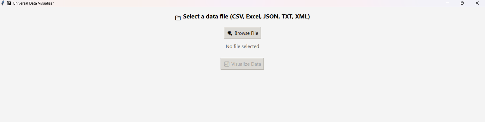
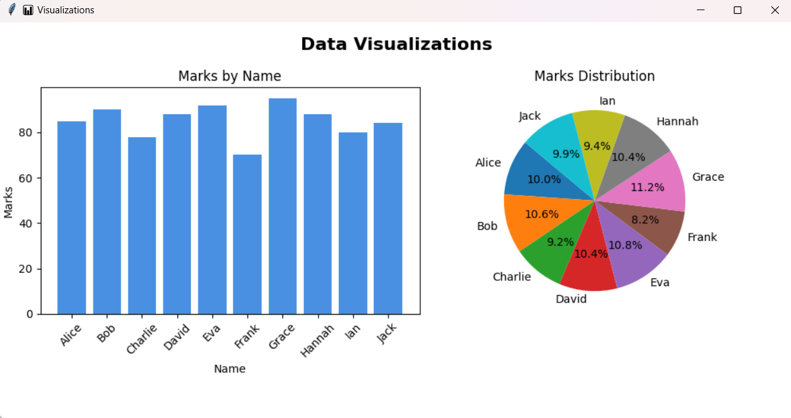

📊 Universal Data Visualizer
A Python GUI app built with Tkinter, Pandas, and Matplotlib that allows users to select a data file (CSV, Excel, JSON, TXT, XML), and instantly visualize the data using beautiful bar and pie charts.

🎯 Features
✅ Simple GUI built with Tkinter

📁 Supports multiple file types:

.csv, .xlsx, .xls, .json, .txt, .xml

📊 Automatic data visualization:

Bar chart (Marks by Name)

Pie chart (Marks distribution)

🧠 Smart file detection and error handling

✨ Enhanced UI/UX with modern styles and feedback

🖼️ Screenshots

## 🖼️ Screenshots

### 📁 File Selection

### 📊 Visualization Window

(You can add these screenshots to your repo in an assets/ folder)

🚀 Getting Started
🔧 Requirements
Make sure Python is installed (Python 3.7+ recommended).

Install required packages:

bash
Copy
Edit
pip install pandas matplotlib openpyxl lxml
▶️ Run the App
bash
Copy
Edit
python app.py
(Replace app.py with your actual file name, e.g., data_visualizer.py)

📂 Supported File Formats
Format	Extension	Parsed Using
CSV	.csv	pandas.read_csv()
Excel	.xlsx	pandas.read_excel()
Excel	.xls	pandas.read_excel()
JSON	.json	pandas.read_json()
TXT	.txt	pandas.read_csv() (comma/tab)
XML	.xml	pandas.read_xml() (requires lxml)

📁 Folder Structure (Suggested)
csharp
Copy
Edit
📦UniversalDataVisualizer/
 ┣ 📜 app.py
 ┣ 📁 assets/
 ┃ ┣ 📷 select-file.png
 ┃ ┗ 📷 visualization.png
 ┗ 📜 README.md
💡 Future Improvements
📌 Column selector (choose which column to plot)

📌 More chart types (line, histogram)

📌 Filter rows (e.g. Age > 20)

📥 Export charts as images

👨‍💻 Author
Priyanshu
